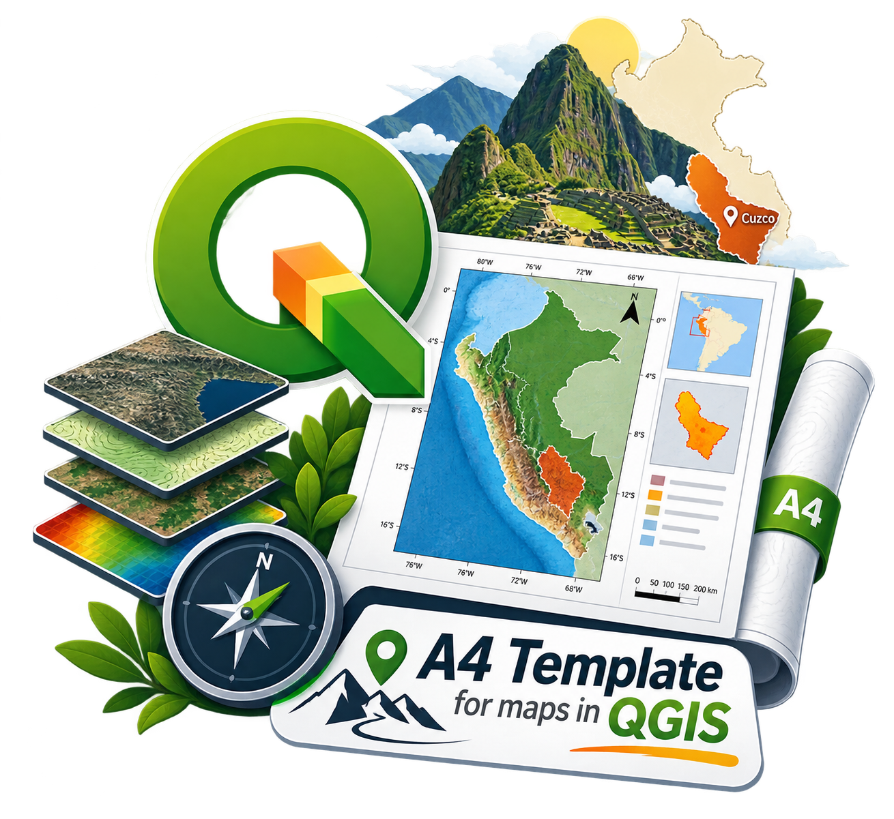

<div align="center">

# 🗺️ A4 Template for Maps in QGIS

**A clean and reusable A4 print layout template for QGIS**

Designed for cartographic work in Peru, with **Cusco** as the default area of focus.

<br>



<br>

[](https://qgis.org/)
[](#)
[](#)

</div>

---

## 📌 About

This repository contains a reusable **A4 print layout template for QGIS**, created to make map design faster, cleaner, and more consistent.

I usually work with maps of **Peruvian territories**, so the template is initially configured with **Cusco, Peru** as the main reference area.

The goal is simple:

> **Open the template → replace your map layers → adjust the extent → export your map.**

---

## ✨ Features

| Feature | Description |
|---|---|
| 📄 **A4 format** | Ready-to-use A4 print layout |
| 🗺️ **Cartographic layout** | Map, legend, scale bar, north arrow and other elements |
| 🇵🇪 **Peru-focused** | Default configuration centered on Cusco, Peru |
| 📐 **Reusable** | Designed to be adapted to different study areas |
| 🎨 **Clean design** | Minimal and publication-oriented visual style |
| 🖨️ **Print ready** | Suitable for PDF and high-resolution export |


## 🚀 Getting Started

### 1. Clone the repository

```bash
git clone https://github.com/YOUR-USERNAME/a4-qgis-template.git